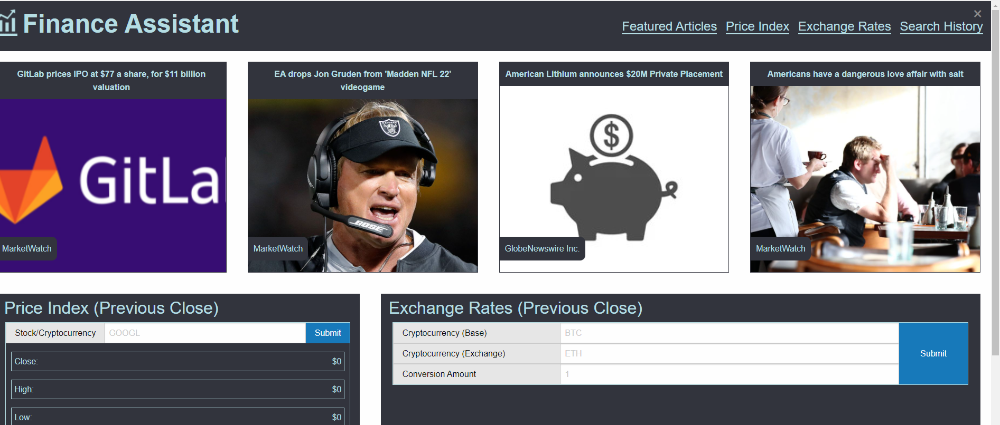
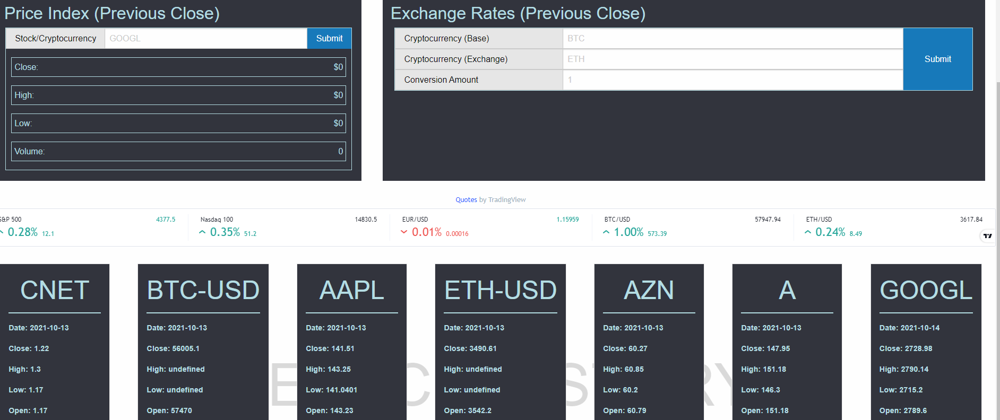

# temp-name

## Discription
Our team was tasked with coming up with a project idea for a front end user page. We decided to make a financial assistant app
that allows a user to seach for a stock or crypto currency. The search uses an API to request data from a third party, it then takes that 
response data. Pulls out the specific information we want to display to the user, and artfully yet efficiently displays that data on the page for the user. Previously searched ticker symbols are stored and displayed in modal cards below the user form, and persist in localStorage in the browser.

## Deployed URL:

## Screenshots

